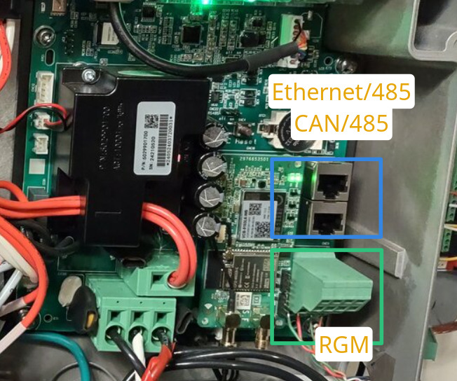

# esphome-delta-lg-monitor

ESPHome config for monitoring a **Delta E-series hybrid inverter** E(4/6/8/10)-TL-US
and an **LG RESU10H-Prime** battery over RS485, on a single ESP32. Publishes ~70 battery registers and the inverter telemetry to MQTT / Home Assistant.  
This may work to monitor an M(4/6/8/10)-TL-US PV only inverter.

It **never transmits on the battery bus** — that side is receive-only, by wiring and by config.

**New to ESPHome?** Start with **[docs/GETTING_STARTED.md](docs/GETTING_STARTED.md)** — a
step-by-step build with nothing assumed.

## The buses

A Delta E-series normally has **two** RS485 buses. This project uses both.
An M-series PV inverter would not be using the RGM bus; no battery or grid meter.
RGM = revenue grade meter, used for inverter & battery modes to control inflow/outflow.

| | **RGM bus** | **the Delta's '485' port** |
|---|---|---|
| where | green RGM terminal block | either RJ45 — pin 7 = A+, pin 8 = B− |
| speed | 9600 8N1 | **38400 8N1**, address 1 |
| who is master | **the Delta** | **nobody** — the Delta is a *slave* here |
| who else is on it | LG RESU at `0x0F`, revenue meter at `0x02` | just the Delta |
| protocol | LG's Modbus register map | **SunSpec** (Modbus RTU, base 40000) **+ Delta's own SOLIVIA**, on the same wire |
| this project | **listens only** — no `tx_pin`, no TX buffer | **polls it** as master |

On the RGM bus, the inverter is the master: it polls the battery and the meter, and
they answer. `0x0E` is a second battery if fitted; `0x03`, `0x1E` and `0xC9` are also addressed.
Adding a silent listener disturbs nothing.

The '485' port is the opposite situation — nobody masters it until you do. That is why a passive
listen there is correctly silent and proves nothing: you have to poll it to get anything.

> 🛑 **Never transmit on the RGM bus.** The Delta masters it, and a second transmitter will corrupt
> its control loop.

### A third bus, if a meter MITM is used

Putting a man-in-the-middle in front of the grid meter splits the meter onto a bus of its
own. The MITM answers the Delta at `0x02` as if it were the meter, and separately polls the real
meter on the new segment:

```
  RGM bus          Delta (master) ─── LG RESU 0x0F
                                  └── MITM answering as the meter 0x02
  meter segment    MITM (master) ──── real revenue meter 0x02
  '485' port       Delta (slave)  ←── this project polls it
```

That is a different project and is **not** part of this repo — see "Related" below.
If you have no MITM, there are two buses and the meter simply sits on the RGM bus.

Two facts that invert how you read negatives on the '485' port, and cost real time to learn:
the device **always NAKs** an unsupported command — so **silence means a comms fault, not
"unsupported"** — and the SOLIVIA log indices are **fixed slot IDs, not dates**.

## Hardware

* **Delta E6-TL-US** inverter — E4/E8/E10-TL-US should work
* **LG RESU Prime 10H** battery — 16H should work



Where the two buses land on an E6-TL-US: the green **RGM** terminal block, and the **'485'** port —
either RJ45 works, pin 7 = A+, pin 8 = B−.

```
ESP32-WROOM-32 (esp32dev, esp-idf)
  UART2  GPIO17 RX only  ->  RGM bus, 9600 8N1      (no tx_pin, no TX buffer)
  UART1  GPIO18 TX / GPIO19 RX -> Delta '485', 38400 8N1
```

Two RS485-TTL modules, auto-direction (no DE/RE pin), powered from the ESP32's 3.3 V rail.

🪤 **GPIO16/17 are used opposite to the devkit silkscreen** (`RX2`/`TX2`). Follow the table, not
the board.

⚠️ The '485' module's driver input is on GPIO18. If no `uart:` declares that pin it floats, which
can spuriously enable the transmitter onto a live bus. The config declares it for that reason even
when not polling.

## Use

```yaml
external_components:
  - source: github://dalklein/esphome-modbus-rtu-sniffer@v1.1.0
    components: [modbus_rtu_sniffer]
  - source: github://dalklein/esphome-delta-lg-monitor
    components: [solivia]
```

🔑 **Note the `@v1.1.0`.** Without a ref, `external_components` tracks the component repo's
default branch, so any push there arrives on your next build once the ~1 day cache expires —
an upstream change landing in firmware you flash to a live device, with nobody choosing it.
Pin it and move the pin deliberately. (ESPHome keys its cache by URL *and* ref, so changing
the ref fetches fresh rather than reusing the old checkout. Clearing `.esphome/` forces a
refetch if you ever need one.)

`solivia` is left unpinned above because it ships from *this* repo — the one you already
cloned — so it moves only when you pull.

Copy `secrets.yaml.example` to `secrets.yaml`, fill it in, then `esphome run delta-monitor.yaml`.

The passive sniffing is done by
[**esphome-modbus-rtu-sniffer**](https://github.com/dalklein/esphome-modbus-rtu-sniffer), a separate
component — see its README for the one setting that matters (`rx_full_threshold` must exceed the
longest burst on your bus).

`components/solivia/` ships here: it speaks Delta's own SOLIVIA protocol, which shares the '485'
wire with SunSpec.

🔑 Pace '485' requests at **≥95–100 ms** per device. That is a property of the hardware, not the
topology.

## What it reads

**LG RESU — 83 registers**, sniffed passively from the Delta's own polling:

| | |
|---|---|
| state of charge | `206`, `221` |
| battery power, signed | `203` |
| pack voltage / current | `215`, `216` |
| DC-bus voltage / current | `202`, `220` |
| **battery temperature, max and min** | `217`, `219` |
| charge / discharge current limits | `226`, `227` (pack side) |
| charge / discharge power limits | `211`-`214`, `229` |
| charge-complete flag | `222` |
| identity and firmware strings | `102`-`103`, `110`-`127`, `141`-`142` |
| config block the inverter writes at boot | `1100`-`1112` |
| alarm block | `2001`-`2034` |

⚠️ **There are no per-cell voltages.** The pack reports aggregate values only — nothing in the map
exposes individual cell voltages, and an exhaustive sweep did not find them. If you need cell-level
data from a RESU Prime, this will not give it to you.

Two register meanings were retracted during this work and are worth knowing, because both looked
solid for days: `226` and `227` are **current limits**, not temperatures. `227` in particular passed
as "warmest cell" for a whole project. The temperature set is exactly two registers, `217` and `219`.

**Delta inverter** — AC current, voltage, power and frequency, apparent and reactive power, and PV
string voltage and current per MPPT, via SunSpec and SOLIVIA.

**The revenue meter at `0x02`**, sniffed from the same RGM bus — `W`, `WphA`, `WphB`, `AphA`,
`AphB` and the variable `W_SF`. The Delta polls the meter on this wire anyway, so these frames
already arrive and cost nothing extra to decode. They answer "what is the inverter being told
about the grid?", which is not the same question as "what is the grid doing" if anything sits
in between.

⚠️ `W_SF` (40022) is **not constant** — 0 means coefficient 1, 1 means coefficient 10, switching
by magnitude. Apply the factor sampled alongside the value, never a remembered one. It arrives
in the same response frame, since the Delta reads `40018` ×5. `AphA`/`AphB` use `A_SF`, a fixed
−1 (0.1 A per count) taken from the meter's register map — the Delta never reads that register,
so it cannot be sniffed.

## Register map

`docs/LG_RESU_Prime_register_map.ods` — the LG read/write registers, the Delta '485' register list,
the SOLIVIA command map, and the learnings behind them.

## Related

A companion project puts an ESP32 **in series with the grid connection meter** — creating the third bus described above — and steers charge and discharge by offsetting what the inverter sees as grid power flow.

That is a different category of thing from this repo: it **transmits**, it **changes inverter
behaviour**. https://github.com/dalklein/esphome-delta-acrel-mitm

## Credits

Built by [@dalklein](https://github.com/dalklein) with [Claude Code](https://claude.com/claude-code).
Protocol findings were cross-checked against an independent Raspberry Pi with an FTDI adapter on the
same bus, and against the vendor apps.

## Licence

[MIT](LICENSE).
